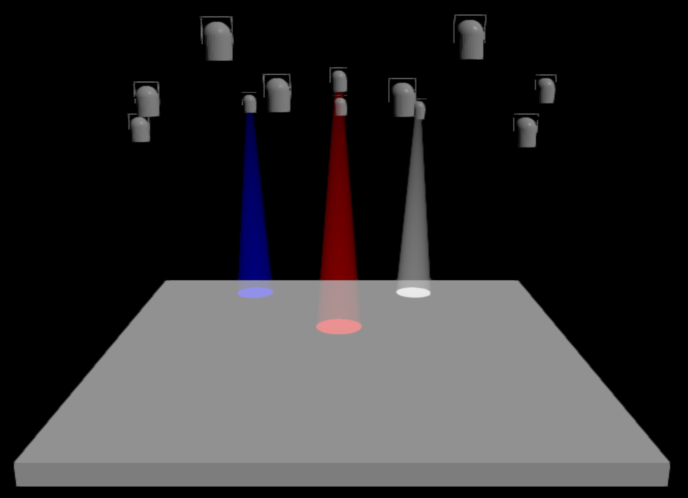
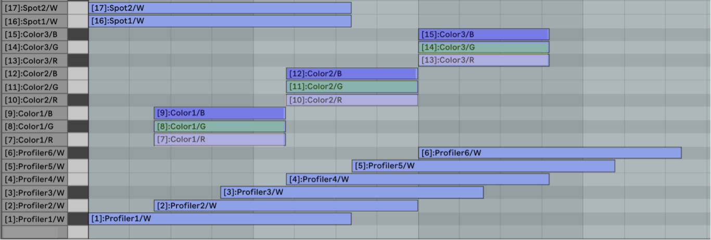

# MIDI-Lichtsteuerung für den Musiksaal (QLC+ Setup)

Dieses Repository enthält ein **einfaches Lichtsteuerungs-Setup für den Musiksaal der Musikschule Simmering**, basierend auf der freien Software **QLC+**.
Damit können Lichteffekte **direkt über MIDI-Clips (z.B. in Ableton Live)** gesteuert werden.

Die Idee ist sehr einfach:

👉 **Bestimmte MIDI-Noten steuern bestimmte Lampen.**

So kann man Licht **wie musikalisches Material programmieren**, z.B. im Piano-Roll-Editor.

---

# Installation

1. **QLC+ herunterladen und installieren:** [https://www.qlcplus.org/](https://www.qlcplus.org/)

2. ➡️ [MS11-2026.qxw herunterladen](MS11-2026.qxw)

in **QLC+ öffnen**.

---

# Grundidee

Das Setup ist so gebaut, dass **MIDI-Noten einzelne Lampen oder Farbkanäle steuern**.

Wenn eine MIDI-Note gespielt wird:

* **Note Velocity = Helligkeit**
* **Note an / aus = Licht an / aus**

Das bedeutet:

* leise Note → schwaches Licht
* starke Note → helles Licht

Man kann also **Licht wie Dynamik komponieren**.

---

# MIDI-Mapping

Die folgenden MIDI-Noten steuern die verschiedenen Lampen im Saal.

## Profiler (Frontlicht)

| MIDI Note | Funktion                  |
| --------- | ------------------------- |
| 1         | Profiler 1 (links außen)  |
| 2         | Profiler 2                |
| 3         | Profiler 3                |
| 4         | Profiler 4                |
| 5         | Profiler 5                |
| 6         | Profiler 6 (rechts außen) |

Die Velocity bestimmt jeweils die **Helligkeit**.

---

## LED-Bars – Block 1

| MIDI Note | Farbe |
| --------- | ----- |
| 7         | Rot   |
| 8         | Grün  |
| 9         | Blau  |

---

## LED-Bars – Block 2

| MIDI Note | Farbe |
| --------- | ----- |
| 10        | Rot   |
| 11        | Grün  |
| 12        | Blau  |

---

## Hauptbühnen-Farblicht

| MIDI Note | Farbe |
| --------- | ----- |
| 13        | Rot   |
| 14        | Grün  |
| 15        | Blau  |

---

## Spots

| MIDI Note | Funktion    |
| --------- | ----------- |
| 16        | Spot links  |
| 17        | Spot rechts |

---

# Arbeiten im DAW (Ableton Live, FL Studio)

Am einfachsten funktioniert die Steuerung über **MIDI-Clips**.

1. Eine **MIDI-Spur erstellen**
2. Den **MIDI-Output auf QLC+ / IAC Driver** setzen
3. Einen **MIDI-Clip öffnen**
4. Im **Piano Roll Editor** die entsprechenden Noten einzeichnen

Beispiel:

* Note **1** → Profiler 1
* Note **2** → Profiler 2
* Note **7** → Rot (LED-Bars)

Die **Velocity der Note bestimmt die Helligkeit**.

---

# Beispiel

Im Repository findet ihr auch ein Beispielbild, das zeigt, wie ein MIDI-Clip im **Ableton Piano Roll** aussehen kann.

So lassen sich z.B.:

* Lichtwechsel
* Farbverläufe
* rhythmische Lichtimpulse
* dynamische Entwicklungen

direkt im **Sequencer programmieren**.

---

# Tipps zum Experimentieren

Ein paar Ideen zum Ausprobieren:

* Akkorde → mehrere Lampen gleichzeitig
* Crescendo → Velocity langsam erhöhen
* Rhythmische Patterns → pulsierendes Licht
* Unterschiedliche Farben kombinieren

Licht kann so **Teil der musikalischen Komposition werden**.

---

# Ziel

Dieses Setup soll eine **einfache Möglichkeit bieten, mit Licht kreativ zu arbeiten**, ohne eine komplexe Lichtsoftware lernen zu müssen.

Wenn etwas unklar ist oder ihr Ideen für Erweiterungen habt, sagt einfach Bescheid!
