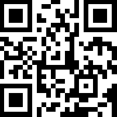

# MIDI-Lichtsteuerung für den Musiksaal (QLC+ Setup)

Dieses Repository enthält ein einfaches Lichtsteuerungs-Setup für den **Musiksaal der Musikschule Simmering**, basierend auf der freien Software **QLC+**.  
Damit können **Lichteffekte direkt über MIDI-Clips** (z.B. in Ableton Live) gesteuert werden.

---

## MIDI-Mapping

| Note | Funktion                  |
| ---- | ------------------------- |
| 1    | Profiler 1 (links außen)  |
| 2    | Profiler 2                |
| 3    | Profiler 3                |
| 4    | Profiler 4                |
| 5    | Profiler 5                |
| 6    | Profiler 6 (rechts außen) |
| ---- | ----- |
| 7    | LED-Bars – Block 1 - Rot   |
| 8    | LED-Bars – Block 1 - Grün  |
| 9    | LED-Bars – Block 1 - Blau  |
| ---- | ----- |
| 10   | LED-Bars – Block 1 - Rot   |
| 11   | LED-Bars – Block 1 - Grün  |
| 12   | LED-Bars – Block 1 - Blau  |
| ---- | ----- |
| 13   | Hauptbühnen-Farblicht - Rot   |
| 14   | Hauptbühnen-Farblicht - Grün  |
| 15   | Hauptbühnen-Farblicht - Blau  |
| ---- | ----------- |
| 16   | Spot links  |
| 17   | Spot rechts |
